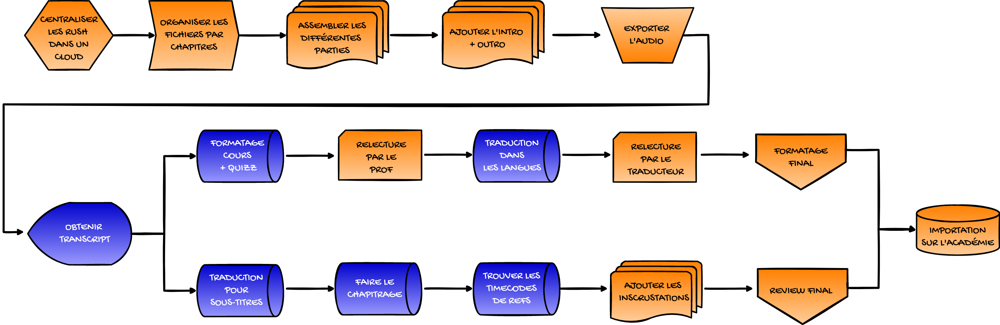

# Core idea 

Produce a *simple* and *modular* program that takes as input an audio file and gives as output a transcript.
This program can also re-format the transcript to get different elements needed for post-production and for the production of educational content about the academy.

The program performs the blue part of this diagram.

## High level structure 

The design pattern of the program has to be a Model-View-Controller architecture in order to facilitate the iteration on the program.

Initially the view can be done with the terminal, then from a window. 
Ideally the user, when launching the program, interacts with a window that asks him for an audio file, and then to choose between a prompt or a set of pre-defined outputs.

The model will be based on the use of the OpenAI API to produce the script with Whisper and the different manipulation of this text with GPT4.

The controller will link the different elements of the model to those of the view.

1.  **Model**: Create a `TranscriptionModel` class that will use the OpenAI API to produce the transcript with Whisper and perform the various manipulations of the text with GPT-4. This class should include methods for:
    
    - Load an audio file
    - Transcribe the audio file using the OpenAI Whisper API
    - Manipulate the transcript with the OpenAI GPT-4 API
    - Save the formatted transcript
2.  **View**: Start by creating a command line interface (CLI) to interact with the user. Later, you can replace it with a graphical user interface (GUI). The view should allow the user to:
    
    - Select an audio file
    - Choose between a custom prompt or a set of predefined outputs
3.  **Controller**: Create a `TranscriptionController` class that will act as a link between the model and the view. The controller should include methods for:
    
    - Get information from the user via the view (audio file and output choices)
    - Call the appropriate methods in the model to perform transcription and text manipulation
    - Update the view with the results obtained from the model
