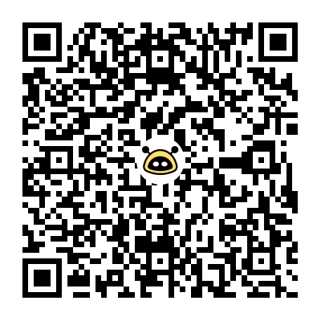

# LLM-Translator

LLM-Translator is a comprehensive tool designed to transcribe audio files utilizing OpenAI's Whisper API and subsequently manipulate the generated transcript through OpenAI's GPT-3.5 API. Additionally, the project offers the capability to translate the transcript into various languages utilizing GPT-3.5.

## Prerequisites

Before utilizing this tool, ensure the installation of:

- Python 3.7 or higher
- OpenAI Python library (`openai`)
- An OpenAI [API key](https://beta.openai.com/docs/api-reference/introduction).

## Installation and Setup

LLM-Translator has been successfully tested on Ubuntu 20.04, with planned compatibility for MacOS and Windows.

1. **Clone the Repository**:  
   - `git clone https://github.com/Asi0Flammeus/LLM-Translator.git`

2. **Navigate to the Project Directory**:  
   - `cd LLM-Translator/`

3. **Set Up OpenAI API Key**:  
   - Create a `.env` file.
    - `nano .env` 
   - Add the following line, replacing `"YOUR_API_KEY"` with your actual OpenAI API key.
    - `OPENAI_API_KEY="YOUR_API_KEY"`

4. **Create a Python Virtual Environment**:  
   - `python3 -m venv env`

5. **Activate the Virtual Environment**:  
   - `source env/bin/activate`

6. **Install Required Libraries**:  
   - `pip3 install -r requirements.txt`

## Usage

0. **Make sure that your repo is up to date:** 
   - `git pull` 

1. **If not already activated, activate the Python Environment**:  
   - `source env/bin/activate`
   - `deactivate` to deactivate the env

2. **Prepare Input Files**:  
   - Create subfolders inside the `/inputs/` directory and populate them with `.txt` and `.md` files you wish to translate. 

3. **Execute the Program**:  
   - `python3 main.py`

4. **Follow the On-screen Instructions** 
   

**Note**: Translations will be automatically stored in an associated subfolder into the `/outputs/` folder. 

## Roadmap

- [X] Language Selection
- [X] Improved Output Organization
- [ ] Comprehensive Testing and Continuous Integration
- [ ] Integration with ChatGPT-4 Model
- [ ] Development of a User-Friendly GUI
- [ ] Integration with Additional LLM Models

## Contributing

Contributions are welcome. To contribute, please fork the repository and create a pull request with your changes. Ensure that changes are tested and existing functionality is maintained.

Here we promote [*Value for Value*](https://dergigi.com/2021/12/30/the-freedom-of-value/) model so if you find value in this humble script tips are welcomed via [LN](https://getalby.com/p/asi0) or by scanning directly this QR code with a Lightning wallet 👇. 

## License

This project is governed by the MIT License. For more information, refer to the [LICENSE file](./license.md).
